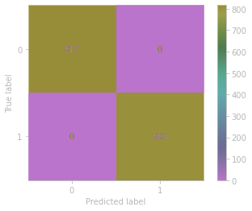

## Summary

### Feature Selection:

- Used category plots for feature selection
- Only used features with at least one pure split.

### Implementation & Optimisation:
- Random Forest Classifier was optimised using a grid search.

### Evaluation
- Accuracy score and F1-Score of 1 was achieved exhibiting perfect predictions on test set.

